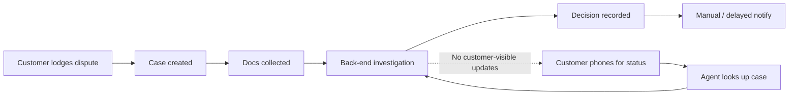
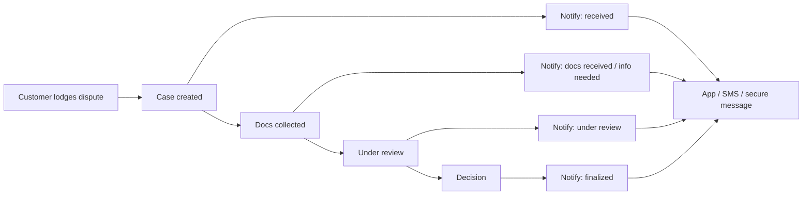

# Process Map — Current vs Future

## Current state (black-hole gap)

The dashed path is the **communication black hole**: investigation progresses internally while customer channels stay silent.

## Future state (event-driven)

## Key finding
Customers do not primarily chase because the process is slow; they chase because they lack **real-time status updates**.
